# 🏙️ GitRepo Cityscape — Feature Implementation Plan

> **15 features** across 3 priority tiers. Each section contains everything you need to implement the feature: architecture, files to create/modify, store changes, code snippets, and testing criteria.

---

## Table of Contents

- [Tier 1: High Impact, Ready to Build](#tier-1-high-impact-ready-to-build)
  - [F1: File Extension Legend](#f1-file-extension-legend)
  - [F2: Building Search & Highlight](#f2-building-search--highlight)
  - [F3: Language Breakdown Chart](#f3-language-breakdown-chart)
  - [F4: Ambient Cyberpunk Audio](#f4-ambient-cyberpunk-audio)
  - [F5: Landing Page](#f5-landing-page)
- [Tier 2: Next Level](#tier-2-next-level)
  - [F6: Shareable URLs](#f6-shareable-urls)
  - [F7: Commit Heatmap Ground](#f7-commit-heatmap-ground)
  - [F8: Building Detail View](#f8-building-detail-view)
  - [F9: Day/Night Toggle](#f9-daynight-toggle)
  - [F10: Mobile Touch Controls](#f10-mobile-touch-controls)
- [Tier 3: Showstopper Features](#tier-3-showstopper-features)
  - [F11: Animated History Replay](#f11-animated-history-replay)
  - [F12: Mini-Map Radar](#f12-mini-map-radar)
  - [F13: Dependency Laser Beams](#f13-dependency-laser-beams)
  - [F14: Social Media Card Generator](#f14-social-media-card-generator)
  - [F15: AI Code Summary](#f15-ai-code-summary)
- [Dependency Map](#dependency-map)
- [Suggested Implementation Order](#suggested-implementation-order)

---

# Tier 1: High Impact, Ready to Build

---

## F1: File Extension Legend

> A color-coded overlay showing what each building color means (`.ts` = blue, `.py` = python blue, etc.)

**Complexity:** ⭐ Easy (1-2 hours)  
**Dependencies:** None  
**New Files:** `src/components/ui/Legend.tsx`  
**Modified Files:** `src/app/page.tsx`, `src/lib/math/layoutGenerator.ts`

### Architecture

```
Legend.tsx reads the color mapping directly from layoutGenerator.ts
It renders as a floating panel in the bottom-left corner
Only shows when repoData is loaded
Auto-detects which extensions exist in the current city
```

### Step-by-Step

#### 1. Extract color map from `layoutGenerator.ts`

Currently `getFileColor()` is a private function. Export the mapping as a constant:

```typescript
// src/lib/math/layoutGenerator.ts

export const FILE_COLOR_MAP: Record<string, { color: string; label: string }> = {
  ts:   { color: '#3178c6', label: 'TypeScript' },
  tsx:  { color: '#3178c6', label: 'TypeScript JSX' },
  js:   { color: '#f7df1e', label: 'JavaScript' },
  jsx:  { color: '#f7df1e', label: 'JavaScript JSX' },
  json: { color: '#000000', label: 'JSON' },
  css:  { color: '#1572b6', label: 'CSS' },
  scss: { color: '#1572b6', label: 'SCSS' },
  html: { color: '#e34f26', label: 'HTML' },
  md:   { color: '#ffffff', label: 'Markdown' },
  py:   { color: '#3776ab', label: 'Python' },
  rs:   { color: '#dea584', label: 'Rust' },
  go:   { color: '#00add8', label: 'Go' },
};

// Refactor getFileColor to use the map
const getFileColor = (filename: string): string => {
  const ext = filename.split('.').pop()?.toLowerCase() || '';
  return FILE_COLOR_MAP[ext]?.color || '#888888';
};
```

#### 2. Create `Legend.tsx`

```typescript
// src/components/ui/Legend.tsx
'use client';

import React, { useMemo } from 'react';
import { useAppStore } from '@/store/useAppStore';
import { FILE_COLOR_MAP } from '@/lib/math/layoutGenerator';
import { Palette } from 'lucide-react';

export const Legend = () => {
  const repoData = useAppStore(state => state.repoData);

  // Only show extensions that exist in the current city
  const activeExtensions = useMemo(() => {
    if (!repoData) return [];
    const exts = new Set<string>();
    repoData.forEach(block => {
      if (block.userData.extension) exts.add(block.userData.extension);
    });
    return Array.from(exts)
      .filter(ext => FILE_COLOR_MAP[ext])
      .sort();
  }, [repoData]);

  if (!repoData || activeExtensions.length === 0) return null;

  return (
    <div className="absolute bottom-5 left-4 z-20 glass-panel p-3 max-h-64 overflow-y-auto">
      <div className="flex items-center gap-2 mb-2 pb-2 border-b border-white/5">
        <Palette size={12} className="text-[var(--neon-cyan)]" />
        <span className="text-[10px] uppercase tracking-widest text-gray-400 font-semibold">
          Building Colors
        </span>
      </div>
      <div className="grid grid-cols-2 gap-x-4 gap-y-1.5">
        {activeExtensions.map(ext => (
          <div key={ext} className="flex items-center gap-2">
            <div
              className="w-3 h-3 rounded-sm border border-white/10"
              style={{ backgroundColor: FILE_COLOR_MAP[ext].color }}
            />
            <span className="text-[10px] text-gray-400 font-mono">.{ext}</span>
            <span className="text-[10px] text-gray-600 truncate">
              {FILE_COLOR_MAP[ext].label}
            </span>
          </div>
        ))}
      </div>
    </div>
  );
};
```

#### 3. Add to `page.tsx`

```tsx
import { Legend } from '@/components/ui/Legend';

// Inside the UI overlay:
<div className="pointer-events-auto">
  <Legend />
</div>
```

### Testing Criteria
- [ ] Legend only appears after a repo is rendered
- [ ] Only extensions present in the current repo are shown
- [ ] Colors match the actual building colors in the 3D scene
- [ ] Panel scrolls if there are many extensions

---

## F2: Building Search & Highlight

> Type a filename → camera auto-flies to that building and highlights it with a pulsing neon ring

**Complexity:** ⭐⭐ Medium (3-4 hours)  
**Dependencies:** None  
**New Files:** `src/components/ui/BuildingSearch.tsx`, `src/components/canvas/HighlightRing.tsx`  
**Modified Files:** `src/store/useAppStore.ts`, `src/components/canvas/CityScene.tsx`, `src/app/page.tsx`

### Architecture

```
BuildingSearch.tsx
  ├── fuzzy search input filtering repoData by name
  ├── dropdown results list
  └── on select → set store.selectedBlock + store.cameraTarget

HighlightRing.tsx (inside Canvas)
  ├── reads store.selectedBlock
  ├── renders a glowing torus/ring at the block's position
  └── animates pulse + rotation

CityScene.tsx
  └── reads store.cameraTarget, lerps camera to it
```

### Step-by-Step

#### 1. Add store fields

```typescript
// src/store/useAppStore.ts — add to AppState interface:
selectedBlock: BuildingBlock | null;
cameraTarget: { x: number; y: number; z: number } | null;
selectBlock: (block: BuildingBlock | null) => void;
```

```typescript
// In the create() body:
selectedBlock: null,
cameraTarget: null,
selectBlock: (block) => {
  if (block) {
    set({
      selectedBlock: block,
      cameraTarget: { x: block.x, y: block.height + 10, z: block.z + 30 }
    });
  } else {
    set({ selectedBlock: null, cameraTarget: null });
  }
},
```

#### 2. Create `BuildingSearch.tsx`

```typescript
// Key logic: fuzzy filter repoData
const results = useMemo(() => {
  if (!query || !repoData) return [];
  const lower = query.toLowerCase();
  return repoData
    .filter(b => b.type === 'blob' && b.name.toLowerCase().includes(lower))
    .slice(0, 10); // Limit to 10 results
}, [query, repoData]);
```

UI: Position it next to the main search bar. Show a dropdown with file icons and paths. On click → `selectBlock(result)`.

#### 3. Create `HighlightRing.tsx`

```typescript
// src/components/canvas/HighlightRing.tsx
export const HighlightRing = () => {
  const selectedBlock = useAppStore(state => state.selectedBlock);
  const ringRef = useRef<THREE.Mesh>(null);

  useFrame((state) => {
    if (!ringRef.current || !selectedBlock) return;
    ringRef.current.rotation.z += 0.02;
    // Pulse scale
    const scale = 1 + Math.sin(state.clock.elapsedTime * 3) * 0.1;
    ringRef.current.scale.setScalar(scale);
  });

  if (!selectedBlock) return null;

  const radius = Math.max(selectedBlock.width, selectedBlock.depth) * 0.8;

  return (
    <mesh
      ref={ringRef}
      position={[selectedBlock.x, selectedBlock.height + 0.5, selectedBlock.z]}
      rotation={[-Math.PI / 2, 0, 0]}
    >
      <torusGeometry args={[radius, 0.15, 16, 64]} />
      <meshBasicMaterial
        color="#00f0ff"
        transparent
        opacity={0.8}
        blending={THREE.AdditiveBlending}
      />
    </mesh>
  );
};
```

#### 4. Camera fly-to logic

In `CityScene.tsx`, add a component that reads `cameraTarget` from the store and lerps the camera:

```typescript
const CameraController = () => {
  const cameraTarget = useAppStore(state => state.cameraTarget);

  useFrame((state) => {
    if (!cameraTarget) return;
    const target = new THREE.Vector3(cameraTarget.x, cameraTarget.y, cameraTarget.z);
    state.camera.position.lerp(target, 0.03);
    state.camera.lookAt(cameraTarget.x, 0, cameraTarget.z - 30);
  });

  return null;
};
```

### Testing Criteria
- [ ] Typing a filename shows matching results in real-time
- [ ] Clicking a result flies the camera smoothly to the building
- [ ] The neon ring pulses and rotates at the selected building
- [ ] Clicking elsewhere or pressing Escape clears the selection
- [ ] Search is case-insensitive

---

## F3: Language Breakdown Chart

> A mini donut chart in the sidebar showing language distribution

**Complexity:** ⭐ Easy (1-2 hours)  
**Dependencies:** None (pure CSS donut chart, no chart library needed)  
**New Files:** None (add directly to Sidebar.tsx)  
**Modified Files:** `src/components/ui/Sidebar.tsx`

### Architecture

Use a CSS conic-gradient donut chart — no need for chart.js or recharts. Compute language percentages from `repoData` by counting file sizes per extension.

### Step-by-Step

#### 1. Compute language stats

```typescript
// Inside Sidebar.tsx, add this useMemo:
const languageStats = useMemo(() => {
  if (!repoData) return [];
  const sizeByLang: Record<string, number> = {};

  repoData.forEach(block => {
    if (block.type === 'blob' && block.userData.extension) {
      const ext = block.userData.extension;
      sizeByLang[ext] = (sizeByLang[ext] || 0) + (block.userData.size || 0);
    }
  });

  const total = Object.values(sizeByLang).reduce((a, b) => a + b, 0);
  return Object.entries(sizeByLang)
    .map(([ext, size]) => ({
      ext,
      size,
      percentage: total > 0 ? (size / total) * 100 : 0,
      color: FILE_COLOR_MAP[ext]?.color || '#888888',
      label: FILE_COLOR_MAP[ext]?.label || ext.toUpperCase(),
    }))
    .sort((a, b) => b.size - a.size)
    .slice(0, 8); // Top 8 languages
}, [repoData]);
```

#### 2. CSS Conic Gradient Donut

```tsx
// Build the conic-gradient string
const gradient = useMemo(() => {
  let accumulated = 0;
  const stops = languageStats.map(lang => {
    const start = accumulated;
    accumulated += lang.percentage;
    return `${lang.color} ${start}% ${accumulated}%`;
  });
  return `conic-gradient(${stops.join(', ')})`;
}, [languageStats]);

// Render:
<div className="relative w-20 h-20 mx-auto my-2">
  <div
    className="w-full h-full rounded-full"
    style={{ background: gradient }}
  />
  {/* Inner hole to create donut */}
  <div className="absolute inset-3 rounded-full bg-[var(--surface-0)]" />
</div>

{/* Legend below */}
<div className="flex flex-wrap gap-x-3 gap-y-1 mt-2">
  {languageStats.slice(0, 4).map(lang => (
    <div key={lang.ext} className="flex items-center gap-1">
      <div className="w-2 h-2 rounded-sm" style={{ backgroundColor: lang.color }} />
      <span className="text-[9px] text-gray-400 font-mono">
        .{lang.ext} {lang.percentage.toFixed(0)}%
      </span>
    </div>
  ))}
</div>
```

### Testing Criteria
- [ ] Donut chart colors match building colors
- [ ] Percentages add up correctly
- [ ] Chart updates when switching repos
- [ ] Handles repos with only 1-2 languages gracefully

---

## F4: Ambient Cyberpunk Audio

> Replace silent WAV placeholders with synthesized audio using Web Audio API

**Complexity:** ⭐⭐ Medium (3-4 hours)  
**Dependencies:** None (use Web Audio API directly)  
**Modified Files:** `src/components/canvas/CityAudio.tsx`  
**New Files:** `src/lib/audio/synthesizer.ts`

### Architecture

Instead of loading external audio files (which requires assets), **synthesize sounds in real-time** using the Web Audio API:

```
CityAudio.tsx
  ├── AmbientDrone: OscillatorNode (low sine wave + noise)
  ├── WindWhisper: filtered white noise
  ├── DataStream: rapid clicking/beeping (synth)
  └── ThunderCrack: noise burst + low rumble (triggered by weather)
```

### Step-by-Step

#### 1. Create audio synthesizer utility

```typescript
// src/lib/audio/synthesizer.ts

export const createAmbientDrone = (ctx: AudioContext): OscillatorNode => {
  const osc = ctx.createOscillator();
  osc.type = 'sine';
  osc.frequency.value = 55; // Low A
  const gain = ctx.createGain();
  gain.gain.value = 0.05;
  osc.connect(gain).connect(ctx.destination);
  return osc;
};

export const createWindNoise = (ctx: AudioContext): AudioBufferSourceNode => {
  // Generate white noise buffer
  const bufferSize = ctx.sampleRate * 2;
  const buffer = ctx.createBuffer(1, bufferSize, ctx.sampleRate);
  const data = buffer.getChannelData(0);
  for (let i = 0; i < bufferSize; i++) {
    data[i] = (Math.random() * 2 - 1) * 0.3;
  }

  const source = ctx.createBufferSource();
  source.buffer = buffer;
  source.loop = true;

  // Band-pass filter for wind-like sound
  const filter = ctx.createBiquadFilter();
  filter.type = 'bandpass';
  filter.frequency.value = 400;
  filter.Q.value = 0.5;

  const gain = ctx.createGain();
  gain.gain.value = 0.02;

  source.connect(filter).connect(gain).connect(ctx.destination);
  return source;
};

export const createThunderCrack = (ctx: AudioContext): void => {
  const bufferSize = ctx.sampleRate * 1.5;
  const buffer = ctx.createBuffer(1, bufferSize, ctx.sampleRate);
  const data = buffer.getChannelData(0);
  for (let i = 0; i < bufferSize; i++) {
    // Decaying noise burst
    data[i] = (Math.random() * 2 - 1) * Math.exp(-i / (ctx.sampleRate * 0.3));
  }
  const source = ctx.createBufferSource();
  source.buffer = buffer;
  const gain = ctx.createGain();
  gain.gain.value = 0.15;
  source.connect(gain).connect(ctx.destination);
  source.start();
};
```

#### 2. Integrate into `CityAudio.tsx`

Replace the silent MP3 approach:

```typescript
export const CityAudio = () => {
  const weather = useAppStore(state => state.weather);
  const [audioCtx, setAudioCtx] = useState<AudioContext | null>(null);

  useEffect(() => {
    const handleInteract = () => {
      const ctx = new AudioContext();
      setAudioCtx(ctx);
      // Start ambient sounds
      createAmbientDrone(ctx).start();
      createWindNoise(ctx).start();
      window.removeEventListener('click', handleInteract);
    };
    window.addEventListener('click', handleInteract);
    return () => window.removeEventListener('click', handleInteract);
  }, []);

  // Thunder on storm weather
  useEffect(() => {
    if (weather !== 'storm' || !audioCtx) return;
    const interval = setInterval(() => {
      if (Math.random() > 0.6) createThunderCrack(audioCtx);
    }, 8000);
    return () => clearInterval(interval);
  }, [weather, audioCtx]);

  return null; // Audio is handled imperatively
};
```

#### 3. Add audio toggle to sidebar

Add a mute/unmute button in the sidebar or export panel.

### Testing Criteria
- [ ] Audio only starts after first user click (browser autoplay policy)
- [ ] Ambient drone is barely audible, not intrusive
- [ ] Wind noise is subtle and atmospheric
- [ ] Thunder only triggers during storm weather
- [ ] Mute button works

---

## F5: Landing Page

> A stunning hero page before the 3D experience

**Complexity:** ⭐⭐ Medium (4-5 hours)  
**Dependencies:** `framer-motion` (already installed)  
**New Files:** `src/app/landing/page.tsx`, `src/components/landing/Hero.tsx`, `src/components/landing/Features.tsx`  
**Modified Files:** `src/app/page.tsx` (redirect logic)

### Architecture

```
/landing (new route)
  ├── Hero.tsx
  │   ├── Animated city silhouette (CSS/SVG)
  │   ├── Glowing title "GitRepo Cityscape"
  │   ├── Subtitle + CTA button "Explore a City →"
  │   └── 3D preview (lightweight canvas with demo buildings)
  │
  ├── Features.tsx
  │   ├── 6 feature cards with icons
  │   ├── Scroll-triggered animations (framer-motion)
  │   └── Before/after comparison slider
  │
  └── Footer.tsx
      ├── GitHub link
      └── Tech stack badges

/ (main app)
  └── Redirects to /landing if no repo param
  └── Shows 3D city if repo param present
```

### Step-by-Step

#### 1. Create landing route

```
src/app/landing/page.tsx
```

#### 2. Hero Component

```tsx
// Key elements:
// 1. Animated gradient background (CSS keyframes)
// 2. Orbitron title with neon glow
// 3. Typing animation for subtitle
// 4. CTA button that navigates to /?repo=facebook/react
// 5. Floating example screenshots/cards

<motion.h1
  initial={{ opacity: 0, y: 30 }}
  animate={{ opacity: 1, y: 0 }}
  transition={{ duration: 0.8 }}
  className="text-6xl font-bold neon-text"
  style={{ fontFamily: 'var(--font-display)' }}
>
  Your Code.<br/>As a City.
</motion.h1>
```

#### 3. Features Section

6 cards using `framer-motion` viewport animation:

```tsx
const features = [
  { icon: '🏗️', title: 'Procedural Generation', desc: 'D3 Squarified Treemaps generate city layouts' },
  { icon: '⏳', title: 'Time Machine', desc: 'Scrub through commit history and watch the city evolve' },
  { icon: '⛈️', title: 'Weather System', desc: 'Failed CI/CD builds trigger thunderstorms' },
  { icon: '👤', title: 'Walk Mode', desc: 'Drop to street level and explore with WASD' },
  { icon: '🔥', title: 'Live Status', desc: 'Hot files glow cyan, PR fires emit smoke' },
  { icon: '📸', title: 'Export', desc: 'Screenshot in 4K or download as .OBJ for 3D printing' },
];
```

#### 4. Routing logic

In `src/app/page.tsx`, optionally show a "Back to Landing" link, or keep the current setup where the landing is a separate route.

### Testing Criteria
- [ ] Landing page loads without the 3D canvas (fast initial load)
- [ ] Animations are smooth and don't feel janky
- [ ] CTA navigates to the main app
- [ ] Works on mobile viewports
- [ ] Page has proper SEO metadata

---

# Tier 2: Next Level

---

## F6: Shareable URLs

> `cityscape.app/?repo=facebook/react` — encode the repo in the URL

**Complexity:** ⭐ Easy (1-2 hours)  
**Dependencies:** None  
**Modified Files:** `src/app/page.tsx`, `src/store/useAppStore.ts`

### Step-by-Step

#### 1. Read URL params on mount

```typescript
// src/app/page.tsx
import { useSearchParams } from 'next/navigation';

const searchParams = useSearchParams();
const repoParam = searchParams.get('repo');

useEffect(() => {
  if (repoParam && !repoData) {
    const url = repoParam.startsWith('http')
      ? repoParam
      : `https://github.com/${repoParam}`;
    fetchData(url);
  }
}, [repoParam]);
```

#### 2. Update URL after fetching

```typescript
// In useAppStore.ts fetchData():
// After successful fetch, update the URL
const shortUrl = url.replace('https://github.com/', '');
window.history.replaceState(null, '', `/?repo=${shortUrl}`);
```

#### 3. Pre-fill SearchBar from URL

```typescript
// In SearchBar.tsx
const repoUrl = useAppStore(state => state.repoUrl);
useEffect(() => {
  if (repoUrl) setInput(repoUrl);
}, [repoUrl]);
```

### Testing Criteria
- [ ] Visiting `/?repo=facebook/react` auto-loads the repo
- [ ] After rendering, URL updates to include the repo
- [ ] Refreshing the page re-loads the same repo
- [ ] Sharing the URL works in a new browser tab

---

## F7: Commit Heatmap Ground

> Color ground districts based on commit frequency

**Complexity:** ⭐⭐ Medium (3-4 hours)  
**Dependencies:** None  
**New Files:** `src/components/canvas/HeatmapGround.tsx`  
**Modified Files:** `src/store/useAppStore.ts`

### Architecture

Replace the flat dark ground with a textured plane where each folder district has a color based on how many recent commits touched files in that directory.

### Step-by-Step

1. **Aggregate commit counts per directory** from `recentFiles` data in the store
2. **Map directory paths to treemap coordinates** using the existing layout data
3. **Create a canvas-based texture** by drawing colored rectangles for each folder
4. **Apply as ground plane material** using `CanvasTexture`

```typescript
// Pseudo-code for texture generation:
const canvas = document.createElement('canvas');
canvas.width = 512;
canvas.height = 512;
const ctx = canvas.getContext('2d');

// For each folder block in repoData:
folders.forEach(folder => {
  const heat = getHeatLevel(folder); // 0-1 based on commit frequency
  const r = Math.floor(heat * 255);
  const g = Math.floor((1 - heat) * 50);
  ctx.fillStyle = `rgb(${r}, ${g}, 50)`;
  // Map folder x,z to canvas coordinates
  ctx.fillRect(mapX(folder.x), mapY(folder.z), mapW(folder.width), mapH(folder.depth));
});

const texture = new THREE.CanvasTexture(canvas);
```

### Testing Criteria
- [ ] Hot directories glow warmer colors on the ground
- [ ] Cold/untouched directories remain dark
- [ ] Heatmap updates when switching commits in the time machine

---

## F8: Building Detail View

> Click a building to show its source code in a floating panel

**Complexity:** ⭐⭐⭐ Hard (5-6 hours)  
**Dependencies:** None (use `<pre>` with manual syntax highlighting via regex, or add `highlight.js`)  
**New Files:** `src/components/ui/CodePreview.tsx`  
**Modified Files:** `src/store/useAppStore.ts`, `src/lib/api/github.ts`

### Step-by-Step

#### 1. Add GitHub file content fetcher

```typescript
// src/lib/api/github.ts
export const fetchFileContent = async (
  repoUrl: string,
  path: string,
  sha?: string
): Promise<string | null> => {
  const { owner, repo } = parseRepoUrl(repoUrl);
  if (!owner || !repo) return null;

  const octokit = new Octokit({
    auth: process.env.NEXT_PUBLIC_GITHUB_TOKEN || undefined,
  });

  try {
    const { data } = await octokit.rest.repos.getContent({
      owner, repo, path,
      ref: sha || undefined,
    });

    if ('content' in data && data.encoding === 'base64') {
      return atob(data.content);
    }
    return null;
  } catch {
    return null;
  }
};
```

#### 2. Add store fields

```typescript
inspectedBlock: BuildingBlock | null;
inspectedCode: string | null;
inspectBlock: (block: BuildingBlock | null) => void;
```

#### 3. Create `CodePreview.tsx`

A draggable panel with syntax highlighting, showing the file path, size, and first ~50 lines of code.

### Testing Criteria
- [ ] Clicking a building opens the code preview
- [ ] Code is fetched from the correct commit SHA (if time machine is active)
- [ ] Panel can be closed with X or Escape
- [ ] Large files show first 50 lines with a "Show more" button

---

## F9: Day/Night Toggle

> Switch between neon night mode and glass-steel daylight

**Complexity:** ⭐⭐ Medium (2-3 hours)  
**Dependencies:** None  
**Modified Files:** `src/store/useAppStore.ts`, `src/components/canvas/CityScene.tsx`, `src/components/ui/Sidebar.tsx`

### Step-by-Step

#### 1. Add store field

```typescript
timeOfDay: 'night' | 'day';
setTimeOfDay: (t: 'night' | 'day') => void;
```

#### 2. Update `WeatherSystem`

```typescript
// Day mode:
<color attach="background" args={['#87ceeb']} />
<ambientLight intensity={0.6} />
<directionalLight position={[50, 100, 50]} intensity={2} />
<Sky sunPosition={[50, 100, 50]} />
<Environment preset="city" />

// Night mode (current):
<color attach="background" args={['#0a0a1e']} />
// ...neon point lights, stars, etc.
```

#### 3. Building material changes

```typescript
// Day: roughness 0.7, metalness 0.2 (matte concrete)
// Night: roughness 0.3, metalness 0.6 (reflective cyberpunk)
```

#### 4. Add toggle to sidebar

```tsx
<button onClick={() => setTimeOfDay(time === 'night' ? 'day' : 'night')}>
  {time === 'night' ? '☀️' : '🌙'}
</button>
```

### Testing Criteria
- [ ] Toggle smoothly transitions between modes
- [ ] Building materials visibly change
- [ ] Stars disappear in day mode
- [ ] Sky and lighting match the time of day

---

## F10: Mobile Touch Controls

> Pinch-to-zoom, swipe-to-orbit, tap-to-inspect

**Complexity:** ⭐⭐ Medium (2-3 hours)  
**Dependencies:** None (`OrbitControls` already supports touch)  
**Modified Files:** `src/components/canvas/CityScene.tsx`, `src/components/ui/Sidebar.tsx`

### Step-by-Step

1. **OrbitControls** from drei already supports touch by default (pinch-zoom, drag-orbit)
2. **Disable Walk Mode on mobile** — detect `'ontouchstart' in window` and hide the Walk button
3. **Increase touch target sizes** — make buttons larger on small screens
4. **Add responsive breakpoints** to sidebar:

```css
@media (max-width: 768px) {
  .sidebar { width: 100%; bottom: 0; top: auto; }
  .search-bar { max-width: 100%; }
}
```

5. **Tap-to-inspect**: Already works via `onPointerMove` on the instanced mesh. On touch, use `onPointerDown` instead since `move` fires differently on mobile.

### Testing Criteria
- [ ] Pinch-to-zoom works on iOS Safari and Chrome Android
- [ ] Sidebar collapses to bottom bar on mobile
- [ ] Walk mode is hidden on mobile
- [ ] Tapping a building shows the tooltip

---

# Tier 3: Showstopper Features

---

## F11: Animated History Replay

> Press Play and watch the city grow from the first commit

**Complexity:** ⭐⭐⭐ Hard (5-6 hours)  
**Dependencies:** None  
**New Files:** `src/components/ui/ReplayControls.tsx`  
**Modified Files:** `src/store/useAppStore.ts`, `src/components/ui/Timeline.tsx`

### Architecture

```
ReplayControls.tsx
  ├── Play / Pause / Speed buttons
  └── Uses setInterval to increment currentCommitIndex

Store changes:
  ├── isReplaying: boolean
  ├── replaySpeed: number (1x, 2x, 5x)
  ├── startReplay: () => void
  └── stopReplay: () => void
```

### Step-by-Step

1. **Start from the oldest commit** (index `commits.length - 1`)
2. **Auto-advance** every N seconds based on `replaySpeed`:
   - 1x = 5 seconds per commit
   - 2x = 2.5 seconds
   - 5x = 1 second
3. **Wait for loading** — don't advance until `isLoading` is false
4. **Stop at index 0** (present) and auto-pause

```typescript
startReplay: () => {
  const { timelineCommits } = get();
  if (timelineCommits.length === 0) return;
  set({
    isReplaying: true,
    currentCommitIndex: timelineCommits.length - 1 // Start from oldest
  });
},
```

### UI

Replace the simple slider with a richer control bar:

```tsx
<div className="flex items-center gap-3">
  <button onClick={isReplaying ? stopReplay : startReplay}>
    {isReplaying ? <Pause /> : <Play />}
  </button>
  <select value={replaySpeed} onChange={...}>
    <option value={1}>1x</option>
    <option value={2}>2x</option>
    <option value={5}>5x</option>
  </select>
  {/* Keep the existing slider too */}
</div>
```

### Testing Criteria
- [ ] Play starts from oldest commit and auto-advances
- [ ] Buildings animate growing with each commit
- [ ] Pause stops the replay
- [ ] Speed control works (1x, 2x, 5x)
- [ ] Reaching present auto-stops

---

## F12: Mini-Map Radar

> Top-down 2D minimap showing building positions with colored dots

**Complexity:** ⭐⭐ Medium (3-4 hours)  
**Dependencies:** None  
**New Files:** `src/components/ui/Minimap.tsx`

### Architecture

Render a `<canvas>` element (HTML Canvas 2D, not Three.js) that draws a top-down view of the city. Show:
- Colored dots for buildings (using their block color)
- A white dot for the camera position
- A viewport frustum indicator

### Step-by-Step

```typescript
// src/components/ui/Minimap.tsx
const MINIMAP_SIZE = 160;
const WORLD_SIZE = 100; // matches TOTAL_WIDTH from layoutGenerator

const Minimap = () => {
  const canvasRef = useRef<HTMLCanvasElement>(null);
  const repoData = useAppStore(state => state.repoData);

  // Sync with Three.js camera via a custom hook
  // Use useFrame inside the Canvas, broadcast camera position to a store field

  useEffect(() => {
    const ctx = canvasRef.current?.getContext('2d');
    if (!ctx || !repoData) return;

    ctx.clearRect(0, 0, MINIMAP_SIZE, MINIMAP_SIZE);
    ctx.fillStyle = 'rgba(10, 10, 20, 0.9)';
    ctx.fillRect(0, 0, MINIMAP_SIZE, MINIMAP_SIZE);

    // Draw each building as a dot
    repoData.forEach(block => {
      if (block.type !== 'blob') return;
      const mx = ((block.x + WORLD_SIZE / 2) / WORLD_SIZE) * MINIMAP_SIZE;
      const mz = ((block.z + WORLD_SIZE / 2) / WORLD_SIZE) * MINIMAP_SIZE;
      ctx.fillStyle = block.color;
      ctx.fillRect(mx - 1, mz - 1, 2, 2);
    });
  }, [repoData]);

  return (
    <canvas
      ref={canvasRef}
      width={MINIMAP_SIZE}
      height={MINIMAP_SIZE}
      className="absolute bottom-5 right-4 z-20 glass-panel"
      style={{ width: MINIMAP_SIZE, height: MINIMAP_SIZE }}
    />
  );
};
```

### Testing Criteria
- [ ] Minimap shows colored dots matching building colors
- [ ] Camera position indicator moves when orbiting
- [ ] Minimap updates when switching repos
- [ ] Performant (doesn't re-render every frame unnecessarily)

---

## F13: Dependency Laser Beams

> Draw glowing neon lines between buildings that import each other

**Complexity:** ⭐⭐⭐ Hard (6-8 hours)  
**Dependencies:** Needs to parse import statements from file content  
**New Files:** `src/components/canvas/DependencyBeams.tsx`, `src/lib/parsers/importResolver.ts`  
**Modified Files:** `src/store/useAppStore.ts`, `src/lib/api/github.ts`

### Architecture

```
1. Fetch file contents for all .ts/.js/.tsx/.jsx files (or top N by size)
2. Parse import statements using regex
3. Resolve relative paths to absolute paths
4. Match source → target building pairs
5. Render THREE.Line or THREE.TubeGeometry between building positions
```

### Step-by-Step

#### 1. Import parser

```typescript
// src/lib/parsers/importResolver.ts

const IMPORT_REGEX = /(?:import|require)\s*\(?['"]([^'"]+)['"]\)?/g;

export const extractImports = (code: string, filePath: string): string[] => {
  const imports: string[] = [];
  let match;
  while ((match = IMPORT_REGEX.exec(code)) !== null) {
    const importPath = match[1];
    // Only resolve relative imports (skip node_modules)
    if (importPath.startsWith('.')) {
      const resolved = resolveRelativePath(filePath, importPath);
      imports.push(resolved);
    }
  }
  return imports;
};

const resolveRelativePath = (from: string, to: string): string => {
  const fromDir = from.substring(0, from.lastIndexOf('/'));
  const parts = fromDir.split('/');
  const toParts = to.split('/');

  for (const part of toParts) {
    if (part === '..') parts.pop();
    else if (part !== '.') parts.push(part);
  }

  return parts.join('/');
};
```

#### 2. Render beams

```typescript
// src/components/canvas/DependencyBeams.tsx
// Use THREE.Line with custom shader for glow effect

const points = [
  new THREE.Vector3(sourceBlock.x, sourceBlock.height, sourceBlock.z),
  new THREE.Vector3(targetBlock.x, targetBlock.height, targetBlock.z),
];

<line>
  <bufferGeometry>
    <bufferAttribute attach="attributes-position" ... />
  </bufferGeometry>
  <lineBasicMaterial
    color="#00f0ff"
    transparent
    opacity={0.3}
    blending={THREE.AdditiveBlending}
  />
</line>
```

### Testing Criteria
- [ ] Lines connect buildings that import each other
- [ ] Only relative imports are shown (not node_modules)
- [ ] Beam colors indicate direction (cyan = imports, magenta = imported by)
- [ ] Can be toggled on/off to avoid visual clutter

---

## F14: Social Media Card Generator

> Auto-generate an Open Graph image from the 3D scene

**Complexity:** ⭐⭐ Medium (3-4 hours)  
**Dependencies:** Next.js built-in `ImageResponse`  
**New Files:** `src/app/api/og/route.tsx`

### Step-by-Step

1. **Create an API route** at `/api/og` that accepts `?repo=owner/name`
2. **Generate a styled card** using `ImageResponse` from `next/og`:

```tsx
// src/app/api/og/route.tsx
import { ImageResponse } from 'next/og';

export async function GET(request: Request) {
  const { searchParams } = new URL(request.url);
  const repo = searchParams.get('repo') || 'your/repo';

  return new ImageResponse(
    <div style={{
      background: 'linear-gradient(135deg, #0a0a14, #1a1a3e)',
      width: '100%', height: '100%',
      display: 'flex', flexDirection: 'column',
      alignItems: 'center', justifyContent: 'center',
      fontFamily: 'monospace',
    }}>
      <div style={{ fontSize: 72, color: '#00f0ff' }}>🏙️</div>
      <div style={{ fontSize: 48, color: '#00f0ff', marginTop: 20 }}>
        GitRepo Cityscape
      </div>
      <div style={{ fontSize: 24, color: '#888', marginTop: 10 }}>
        {repo}
      </div>
    </div>,
    { width: 1200, height: 630 }
  );
}
```

3. **Add metadata** to `layout.tsx`:

```tsx
export const metadata: Metadata = {
  openGraph: {
    images: ['/api/og?repo=facebook/react'],
  },
};
```

### Testing Criteria
- [ ] `/api/og?repo=facebook/react` returns a PNG image
- [ ] Image looks good when shared on Twitter/Discord/Slack
- [ ] Dynamic repo name appears in the card

---

## F15: AI Code Summary

> Hover over a building → AI generates a one-sentence summary

**Complexity:** ⭐⭐⭐ Hard (4-5 hours)  
**Dependencies:** Gemini API key or OpenAI API key  
**New Files:** `src/app/api/summarize/route.ts`  
**Modified Files:** `src/components/ui/Tooltip3D.tsx`, `src/store/useAppStore.ts`

### Architecture

```
1. User hovers over a building for 2+ seconds
2. Fetch first 100 lines of the file from GitHub
3. Send to /api/summarize (server-side → Gemini/OpenAI)
4. Cache the result in the store
5. Display in tooltip
```

### Step-by-Step

#### 1. API route

```typescript
// src/app/api/summarize/route.ts
import { GoogleGenerativeAI } from '@google/generative-ai';

export async function POST(req: Request) {
  const { code, filename } = await req.json();

  const genAI = new GoogleGenerativeAI(process.env.GEMINI_API_KEY!);
  const model = genAI.getGenerativeModel({ model: 'gemini-2.0-flash' });

  const result = await model.generateContent(
    `In exactly one sentence, describe what this file does:\n\nFilename: ${filename}\n\n${code.substring(0, 3000)}`
  );

  return Response.json({ summary: result.response.text() });
}
```

#### 2. Store caching

```typescript
// Add to store:
summaryCache: Record<string, string>; // path → summary
fetchSummary: (block: BuildingBlock) => Promise<void>;
```

#### 3. Tooltip integration

Show a "🤖 AI: ..." line in the tooltip after the summary is loaded.

### Testing Criteria
- [ ] Summary appears after 2-second hover
- [ ] Summaries are cached (same file doesn't re-fetch)
- [ ] Graceful fallback if API key is missing
- [ ] Summary is concise (one sentence)

---

# Dependency Map

```mermaid
graph TD
    F1["F1: Legend"] --> |reads| LG["layoutGenerator.ts"]
    F2["F2: Building Search"] --> |reads| Store["useAppStore.ts"]
    F3["F3: Language Chart"] --> |reads| LG
    F4["F4: Audio"] --> |reads| Store
    F5["F5: Landing Page"] --> |independent| Landing["New route"]
    F6["F6: Shareable URLs"] --> |modifies| Store
    F7["F7: Heatmap"] --> |reads| Store
    F8["F8: Code Preview"] --> |needs| GH["github.ts"]
    F9["F9: Day/Night"] --> |modifies| CS["CityScene.tsx"]
    F10["F10: Mobile"] --> |modifies| CS
    F11["F11: Replay"] --> |extends| F6
    F12["F12: Minimap"] --> |reads| Store
    F13["F13: Dep Beams"] --> |needs| GH
    F14["F14: OG Image"] --> |independent| API["API route"]
    F15["F15: AI Summary"] --> |needs| GH

    style F1 fill:#0a2a3a,stroke:#00f0ff
    style F2 fill:#0a2a3a,stroke:#00f0ff
    style F3 fill:#0a2a3a,stroke:#00f0ff
    style F4 fill:#0a2a3a,stroke:#00f0ff
    style F5 fill:#0a2a3a,stroke:#00f0ff
    style F6 fill:#1a1a3a,stroke:#ff00e5
    style F7 fill:#1a1a3a,stroke:#ff00e5
    style F8 fill:#1a1a3a,stroke:#ff00e5
    style F9 fill:#1a1a3a,stroke:#ff00e5
    style F10 fill:#1a1a3a,stroke:#ff00e5
    style F11 fill:#2a1a2a,stroke:#ffaa00
    style F12 fill:#2a1a2a,stroke:#ffaa00
    style F13 fill:#2a1a2a,stroke:#ffaa00
    style F14 fill:#2a1a2a,stroke:#ffaa00
    style F15 fill:#2a1a2a,stroke:#ffaa00
```



---

# Suggested Implementation Order

> Follow this order to maximize value at each step. Features within the same tier can be parallelized.

| Sprint | Features | Time Estimate | Why This Order |
|--------|----------|---------------|----------------|
| **Sprint 1** | F1 (Legend) + F6 (URLs) | ~3 hours | Quick wins that dramatically improve usability |
| **Sprint 2** | F3 (Language Chart) + F9 (Day/Night) | ~4 hours | Visual polish that makes the app feel complete |
| **Sprint 3** | F2 (Building Search) | ~4 hours | Core interaction feature, needs store changes |
| **Sprint 4** | F5 (Landing Page) + F14 (OG Image) | ~6 hours | Public-facing features for sharing |
| **Sprint 5** | F4 (Audio) + F12 (Minimap) | ~5 hours | Immersion features |
| **Sprint 6** | F11 (History Replay) | ~5 hours | Extends the time machine experience |
| **Sprint 7** | F8 (Code Preview) + F10 (Mobile) | ~7 hours | Deeper interaction and accessibility |
| **Sprint 8** | F7 (Heatmap) + F13 (Dep Beams) | ~10 hours | Advanced visualization, most complex |
| **Sprint 9** | F15 (AI Summary) | ~5 hours | Requires external API key setup |

**Total estimated time: ~49 hours** (roughly 6 full working days)

---

> **IMPORTANT:** Before starting any feature, create a new branch: `git checkout -b feature/F{N}-{name}`. This follows your project convention in MEMORY.md.
